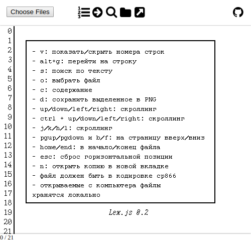

# lex-js

Lexicon Viewer JS port.

Lexicon was a text editor / word processor MS-DOS program that was extremely popular in the Soviet Union and Russia at the end of 1980s and in 1990s.

[Lexicon Viewer](http://www.lexview.spb.ru/) is a tool that provides read-only access to documents created in Lexicon. It exists in both Windows and UNIX versions.

lex-js is a reimplementation of Lexicon Viewer as a web application.

# Preview

# Features

- reading documents both from server and from local computer
- copying text contents to clipboard
- saving selected document areas as PNG
- saving files between sessions (no need to open the same file twice)
- line numbers (optional)

# Hotkeys

| Key | meaning |
|-----|---------|
| v  | toggle line numbers  |
| alt+g | go to line... |
| s | start searching |
| o | open file from local computer |
| c | open contents (list of remote files and directories) |
| up/down/left/right | scrolling |
| ctrl+up/down/left/right | scrolling |
| j/k/h/l | scrolling (vim-style) |
| pgup / pgdown | scroll one screen up/down |
| b / f | scroll one screen up/down |
| home / end | scroll to the top / bottom of the document |
| esc | reset horizontal position of the file |
| n | open this file in new tab |
| d | download selected area as PNG |
| ctrl+c | copy selected area of text to clipboard |

# Usage

1. Clone this repository or download the archive to your webserver's root
2. Make sure that directory index is `index.php`, not `index.html` in order to set page title and other info.
3. [optional] Change settings in `files/config-user.php`.
4. [optional] Change settings in `config.js` (check out `src/config-default.js`)

# Usage without webserver

You can freely use this app without setting up a webserver by opening `index.html` directly in your browser, however, content listing will not work, as it relies on the server-side code to provide file info. Preserving local files in a browser storage may not work too, because it depends on how IndexedDB API is implemented in the browser.

A precompiled JS bundle is included in this source repository to make serverless usage possible.

